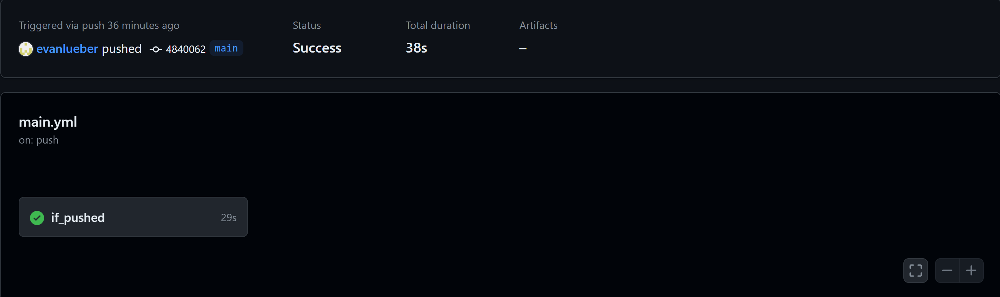
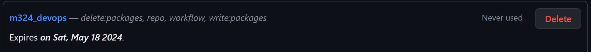
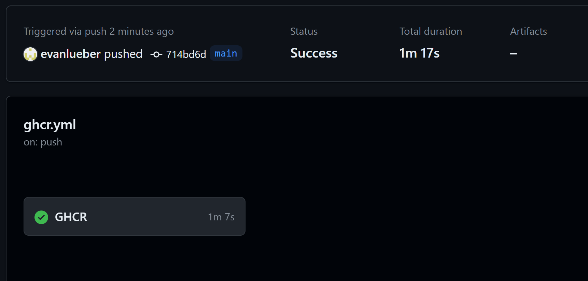

# M324 DevOps
## Aufgabe 1
1. Ich habe ein GitHub-Repository erstellt
2. Danach habe ich das Repository geklont
3. Ich habe das Repository m346-ref-card-02 heruntergeladen.
4. In diesem Repository habe ich ein Dockerfile erstellt.
```Dockerfile
FROM node:latest
WORKDIR /app
RUN git clone https://github.com/evanlueber/m324_devops.git
WORKDIR /app/m324_devops/aufgabe1
EXPOSE 3000
ENTRYPOINT ["npm", "run", "start"]
```
5. Danach habe ich ein Docker-Hub Repository vorbereitet.
6. Im Anschluss habe ich eine GitHub Action erstellet, die ausgeführt wir, wenn etwas auf das Repository gepusht wird.
```yml	
# Workflow wird bei Push-Events auf den Hauptzweig ausgelöst
name: "Build and Push to Server"
on:
  push:
    branches: [main]

# Umgebungsvariablen definieren
env:
  working-directory: ./  # Arbeitsverzeichnis für den Job

# Jobs definieren
jobs:
  # Job wird bei jedem Push-Event ausgeführt
  if_pushed:
    runs-on: ubuntu-latest
    steps:
      # Schritt 1: Repository auschecken
      - name: Repository auschecken
        uses: actions/checkout@v4

      # Schritt 2: Bei Docker Hub mit den bereitgestellten Anmeldedaten anmelden
      - name: Bei Docker Hub anmelden
        uses: docker/login-action@f4ef78c080cd8ba55a85445d5b36e214a81df20a
        with:
          username: ${{ secrets.DOCKER_USERNAME }}
          password: ${{ secrets.DOCKER_PASSWORD }}

      # Schritt 3: Metadaten (Tags, Labels) für das Docker-Image extrahieren
      - name: Metadaten (Tags, Labels) für Docker extrahieren
        id: meta
        uses: docker/metadata-action@9ec57ed1fcdbf14dcef7dfbe97b2010124a938b7
        with:
          images: evanlueber/m324-devops

      # Schritt 4: Docker-Image bauen und pushen
      - name: Docker-Image bauen und pushen
        uses: docker/build-push-action@3b5e8027fcad23fda98b2e3ac259d8d67585f671
        with:
          context: .
          file: ./Dockerfile
          push: true
          tags: ${{ steps.meta.outputs.tags }}
          labels: ${{ steps.meta.outputs.labels }}
```

7. Danach habe ich auf Github in meinem Repository ein Secret erstellt, in dem ich meine Docker-Hub Anmeldedaten hinterlegt habe.

## Aufgabe 2
1. Ich habe eine GitHub Access Token erstellt und habe workflow, write un delete Rechte gegeben.

2. Danach habe ich ein GitHub Action erstellt
```yml
name: "Build and Push to GHCR"
on:
  push:
    branches: [main]

env:
  working-directroy: ./

jobs:
  GHCR:
    runs-on: ubuntu-latest
    permissions:
      contents: read
      packages: write
    steps:
      - name: Check out the repo
        uses: actions/checkout@v4
        
      - name: 'Login to GitHub Container Registry'
        uses: docker/login-action@v1
        with:
          registry: ghcr.io
          username: ${{github.actor}}
          password: ${{secrets.GITHUB_TOKEN}}

      - name: 'Build and Push Docker Image'
        run: |
            docker build ./ref-card-02 --tag ghcr.io/evanlueber/m324_devops:latest
            docker push ghcr.io/evanlueber/m324_devops:latest
```


## Aufgabe ECR
1. Ich habe den Befehl für das erstellen eines ECR Repository ausgeführt.
```bash
aws ecr create-repository \
    --repository-name ecr-devops \
    --region us-east-1
```
2. Ich habe Environmentvariabeln für das ECR Repository erstellt.
3. Ich habe ein GitHub Action erstellt, das ich von GitHub Actions Anleitung habe.
4. Ich habe den AWS_SESSION_TOKEN Secret dem yaml hinzugefügt
5. Ich habe Secrets für die AWS Access Keys erstellt.
```yml
name: Deploy to Amazon ECS

on:
  push:
    branches:
      - main

env:
  AWS_REGION: MY_AWS_REGION
  ECR_REPOSITORY: MY_ECR_REPOSITORY

jobs:
  deploy:
    name: Deploy
    runs-on: ubuntu-latest
    environment: production

    steps:
      - name: Checkout
        uses: actions/checkout@v4

      - name: Configure AWS credentials
        uses: aws-actions/configure-aws-credentials@0e613a0980cbf65ed5b322eb7a1e075d28913a83
        with:
          aws-access-key-id: ${{ secrets.AWS_ACCESS_KEY_ID }}
          aws-secret-access-key: ${{ secrets.AWS_SECRET_ACCESS_KEY }}
          aws-region: ${{ env.AWS_REGION }}

      - name: Login to Amazon ECR
        id: login-ecr
        uses: aws-actions/amazon-ecr-login@62f4f872db3836360b72999f4b87f1ff13310f3a

      - name: Build, tag, and push image to Amazon ECR
        id: build-image
        env:
          ECR_REGISTRY: ${{ steps.login-ecr.outputs.registry }}
          IMAGE_TAG: ${{ github.sha }}
        run: |
          docker build -t $ECR_REGISTRY/$ECR_REPOSITORY:$IMAGE_TAG .
          docker push $ECR_REGISTRY/$ECR_REPOSITORY:$IMAGE_TAG
          echo "image=$ECR_REGISTRY/$ECR_REPOSITORY:$IMAGE_TAG" >> $GITHUB_OUTPUT
```